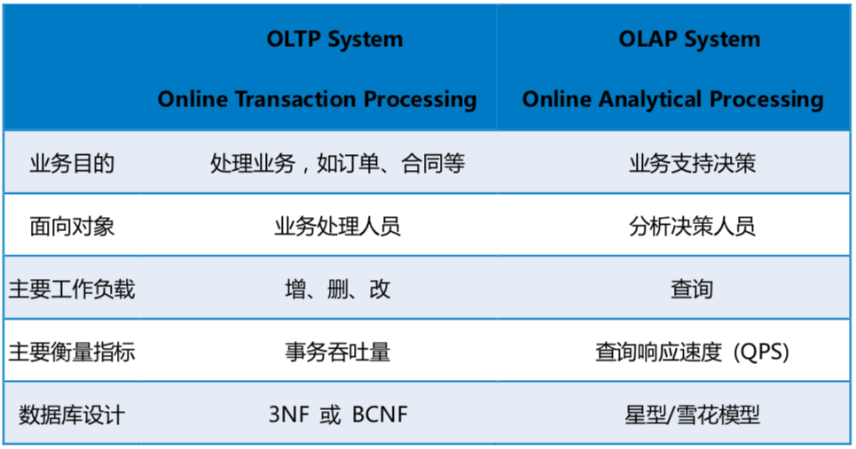

### HTAP （Hybrid Transactional / Analytical Processing）

#### background

- OLTP(Online Transactional Processing) 联机事务处理, 主要是对数据的增删改

- OLAP(Online Analytical Processing) 联机分析处理, 主要是对数据的查询

> 因为OLTP所产生的业务数据分散在不同的业务系统中，而OLAP往往需要将不同的业务数据集中到一起进行统一综合的分析，这时候就需要根据业务分析需求做对应的数据清洗后存储在数据仓库中，然后由数据仓库来统一提供OLAP分析。所以我们常说OLTP是数据库的应用，OLAP是数据仓库的应用。所以OLAP和OLTP之间的关系可以认为OLAP是依赖于OLTP的，因为OLAP分析的数据都是由OLTP所产生的，也可以看作OLAP是OLTP的一种延展，一个让OLTP产生的数据发现价值的过程。
>
> 

#### implementation

- PingCAP 的 TiDB
- 阿里云的 HybridDB for MySQL
- 百度的 BaikalDB

#### type

- 单一系统承载 OLTP 和 OLAP（Single System for OLTP and OLAP）
- 分离的 TP 与 AP 系统（Separate OLTP and OLAP System）

### F1 Lightning

> 分离系统的好处是可以单独针对 TP 和 AP 进行设计，互相之间侵入较小，但在既有的架构下，往往需要通过离线 ETL 来转运数据（原因分析可以参考我们这篇对存储部分的分析）。而 F1 Lightning 设计也落在分离系统的范畴，使用了 CDC 进行实时数据勾兑而非离线 ETL，那毫无疑问，F1 的列存部分设计也需要和我们一样针对列存变更进行设计。
>
> 顺口提一下，论文中分析相关工作时也提到了 TiDB 和 TiFlash，不过这部分描述却是错误的，TiDB 和 Lightning 一样可以提供 Strong Snapshot Consistency，甚至由于它的独特设计，还能提供更强的一致性和新鲜度。

#### 优点

> Lightning 相对于既有 HTAP 系统，**提供了如下几个（TiDB HTAP 也一样拥有的甚至更好）优势**：
>
> 1. 拥有只读的列存副本，提供了更好的执行效率以
> 2. 相对于 ETL 流程，提供了更简单的配置和去重
> 3. 无需修改 SQL 直接查询 HTAP
> 4. 一致性和新鲜度
> 5. 安全方面 TP 与 AP 两部分统一
> 6. 设计关注点分离，TP 和 AP 可以分别针对性优化自己的领域而不过多牵扯
> 7. 扩展性，提供了对接除了 F1 DB 和 Spanner 以外不同的 TP 数据库的可能性

#### 系统架构

> 由于项目立项的前提是对 TP 系统无侵入性，因此作为 HTAP 来说，F1 Lightning 的架构设计相对保守。现有 HTAP 的研究领域，大多数项目都是以所谓 Greenfield 方案（不受前序方案约束）为假设，但 F1 Lightning 需要在对现有业务不做任何迁移且设计方案最大程度不对 TP 系统做修改（组织架构层面，F1 Lightning 团队也不管 TP 系统的代码），所以他们做出了一个 「A loosely coupled HTAP solution」，这是一个犹如驴标蛇皮袋一般巨朴实的方案：通过 CDC 做 HTAP。所以实际上，F1 Lightning 是一个 CDC + 可变更列存的方案。
>
> 
>
> 
>
> Google 的现有 TP 系统大多选用 MVCC 模型（Multi-Version Concurrency Control 多版本并发控制）, 对于读取语义，Lightning 也选择了 MVCC 和相应的快照隔离：由 TP 发出的 CDC 如果带着时间戳向 Lightning 进行复制，MVCC 会是一个最自然而且最方便的设计。
>
> 而由于分布式 CDC 架构的天然约束和特性，Lightning 选择提供 Safe Timestamps 来保持一致性。这是一个类似水位线的设计，因为经过一次分布式分发，因此不同存储服务器接收到数据将会带来不等同的延迟，因此无法简单保证一致性。所以类似这样水位线的设计可以以数据新鲜度为代价换取查询的快照一致性。

#### 存储

### Reading Note

#### 0. Abstract

HATP系统的需求日益增长，目前已有很多解决办法，一种方法是从头开始设计相关的HTAP系统，但是“我们”面临的挑战是：**已存在大量的OLTP系统，联合查询引擎并不嵌入在这些系统中，需要有一个透明的中间层为新旧应用快速查询提供整合。**

#### 1. Introduction

很多文献提出了HTAP系统的架构与设计，本文考虑一种不同的方式：**一种松散耦合的HTAP体系结构，可以支持各种约束下的HTAP工作负载。**

原因是谷歌复杂的数据生态系统，谷歌中使用多个事务性数据存储来服务大型旧版和新工作负载的数据。  

Lightning 服务及其相关联合查询引擎集成的功能：

- 创造数据的读优化副本，维持其一致性和新鲜性
- 管理复制
- 优化跨越事务和Lightning表的查询
- 对使用者的查询引擎是透明的
- 对事务存储也是透明的
- Lightning 服务由不拥有事务存储的团队管理和开发

#### 2. Related work

HTAP的设计方案分为“集成OLTP和OLAP的单个系统”和“OLTP和OLAP分离的系统”。

前者使用混合的行组织和列组织以获取比单独数据组织更好的事务处理和分析处理，谷歌因为无法大规模迁移数据到一个完整的新系统故不能采用这种方法。

后者继续细分为两类：OLTP和OLAP使用共享存储或解耦存储，共享存储通常需要修改OLTP以加速分析查询，Lightning则使用解耦存储方式。

很多松散耦合存储的HTAP系统使用分离的线下ETL(Extract, Transform, Load) 处理方式，OLTP数据转换到OLAP的副本的延迟较高，F1 Lightning使用CDC(Change Data Capture)机制 + 类LVM的内存与磁盘多层混合存储。

##### SAP HANA ATR

- OLTP：行存储 

- OLAP：使用并行日志重放方案维持一个列存储副本

与F1四点不同：

1. SAP 需要修改OLTP系统
2. SAP 运行在单机上，而google是分布式事务系统
3. SAP 使用自己的查询系统，而google使用联合查询引擎
4. Lightning 作为一个透明的服务，具有替换性

适用于一开始就选择使用HTAP的系统。

##### TiFlash

TIDB的列状存储扩展，它向行存储TiDb添加了一个列状存储和矢量化处理层，只与TiDB保持比较随意的一致性，Lightning 在源数据和查询窗口上提供强快照一致性

##### Oracle DBIM

为活跃数据维持内存列存储，并与持久化的行存储保持一致性。

##### 基于中间件的数据库复制系统

使用ETL(Extract, Transform, Load)处理数据，没有为快速分析的副本生成进行优化，也没有提供透明的HTAP体验。

##### CDC (Change Data Capture)：Databus

与重新导入整个数据集的传统ETL方法相比，CDC通常改进了更改传播延迟和更改复制效率。

Databus不提供完整的HTAP服务，Lightning设计了类似的Changepump。

##### 与SQL引擎紧密结合的HTAP方案：Wildfire和SnappyData

结合SparkSQL引擎和自己的HTAP，本质上依然是HTAP系统。

#### 3. SYSTEM OVERVIEW

- 三个主要部分：
  - OLTP数据库：F1DB 和 Spanner，关系型数据库
  - F1分布式查询引擎：GoogleSQL；联合查询引擎，支持不同的网络数据源，查询吞吐大
  - Lightning 

- 事务处理和分析查询的优化权衡：
  - 分层存储和分片存储

- F1DB和Spanner使用行存储和索引优化写吞吐，导致F1查询性能的次优，尽管F1可以在多个worker上使用分布式分析查询来抵消这种性能损失，但为了维持合理的延迟又带来了巨大的计算资源消耗
- 为了解决上述问题，一些团队使用管道复制F1DB表数据到列格式存储文件中进行进一步的分析，但其存在很多问题：
  1. 碎片化的工程投入和冗余的存储：很多team维持相同的存储
  2. 列存储文件不支持就地更新，需要定期重塑整个系统，其维护的数据集的更新性也变得很差
  3. 由于物理存储方式的改变，用户需要具体修改他们的查询语句来适配新的数据源
  4. 元数据库和抽取数据的访问权限需保持同步，这增加了维护开销和安全漏洞的风险
- 为了解决上述问题，Lightning 从OLTP复制数据为一种为分析查询的优化格式。
  - 可在一个表或整个数据库上启用
  - Changepump，使用F1DB提供的日志传输接口实现“更改数据捕获“机制，将数据的改变发送到Lightning的服务器进行分区管理，每个分区维护一个基于LSM tree存储的分布式文件系统
  - Lightning 捕获这些数据改动，将其从行组织格式转换为列组织格式
  - 支持异步维护附加数据（如索引和汇总）
  - 在不影响事务吞吐的情况下改善查询性能

- Lightning 使用OLTP的快照一致性来捕获数据：

  - F1DB和Spanner支持MVCC（使用时间戳），每一个数据变更Lightning都保留它的时间戳，保证对于相同时间戳读的数据是相同的，并且它所接收的所有更改都将用完全保真度和等效于源数据库的语义来表示

    > MVCC (multi-version concurrency control, 多版本并发控制)数据库需要更新一条数据记录的时候，它不会直接用新数据覆盖旧数据，而是将旧数据标记为过时（obsolete）并在别处增加新版本的数据。这样就会有存储多个版本的数据，但是只有一个是最新的。这种方式允许读者读取在他读之前已经存在的数据，即使这些数据在读的过程中半路被别人修改、删除了，也对先前正在读的用户没有影响。这种多版本的方式避免了填充删除操作在内存和磁盘存储结构造成的开销，但是需要系统周期性整理（sweep through）以删除老的、过时的数据。（写不需要覆盖原数据不影响读）
    >
    > 
    >
    > 作者：小幸运Q
    > 链接：https://www.jianshu.com/p/85bfe0d61c01

  - F1引擎利用这一点，自动重写查询加速查询性能：若需要读的时间戳的数据已经存在于Fightning中，可直接从Fightning中读取；重写可逐表进行，意味着一些表的查询从Fightning中，另一些从OLTP中

- 实现了以下优点：
  - 提高了分析查询的资源效率和延迟
  - 配置简单，消除重复数据
  - 用户体验透明，无需修改SQL
  - 保证数据一致性和新鲜性
  - 保证数据安全性
  - 关注于系统的松散耦合分离，Lightning和DB的开发团队可各司其职互不干涉
  - 可扩展性，支持具有CDC机制的OLTP数据库

#### 4. Lightning Architecture

结构包括：

- **Data storage**：持续请求获取CDC数据，读优化且与OLTP语义相同，后台对数据进行压缩（LVM merger）
- **Change replication**：负责CDC数据的管理，重放历史
- **Metadata database**: 状态存储
- **Lightning masters** : 管理和协调者

##### 4.1 Read semantics

- MVCC和快照隔离：查询具体时间戳的数据
- OLTP日志CDC数据具有延时
- 查询窗口：minimum safe timestamp 单一版本快照，maximum safe timestamp 多版本记录

##### 4.2 Table and deltas

- Lightning table 按照范围分区存储到一个分区集合中，每个分区（**delta**)存储组织为一个多组的LSM tree
- 每一行区分为 <key, timestamp>, key ASC, timestamp DESC，具有三种写操作：INSERT、UPDATE、DELETE
- 不同分区可能存在冗余的版本

##### 4.3 Memory-resident deltas

- CDC数据首先被写入内存中，组织为行存储的B树，牺牲一些查询性能以保持高更新率
- 允许多个reader，最多允许两个活跃的writer
- 使用一个线程从log中apply new changes，运行后台线程回收时间窗口前的删除版本
- 并发时采用copy-on-write机制
- 不维持write-ahead-log，从OLTP的log中恢复
- 定期创建检查点，将内存数据写入磁盘，内存数据不做改变
- 将deltas数据写入磁盘，行组织转换为列组织，写完后查询读取数据重定向到磁盘中

##### 4.4 Disk-resident deltas

- 存储大部分Lightning数据，为读优化对列文件进行排序
- 构建了一个抽象层提供公共接口为不同的列文件格式存储
- delta file存储两个部分：数据部分和索引部分。数据部分采用PAX模式，索引采用稀疏B树追踪row bundle，索引较小通常缓存在Lightning服务器上。这种架构可以平衡范围查询和点查询性能。

##### 4.5 Delta merging

因为Lightning存储某一行的version可能在不同的deltas，所以需对deltas进行merge。

merging包含两种具体操作：merging和collapsing，前者消除重复的changes复制不同的versions到一个新的delta中，后者合并相同key的不同version到一个单一的version（窗口前？）

采用LSM的逻辑，提前枚举需要merge的deltas，可以添加谓词过滤versions。Lightning重复执行两个阶段（**merge plan generation**和**merge plan application**)进行k路归并:

- merge plan generation: 读入一个块的keys识别哪些key需要collapse哪些需要merge，因为相同key的不同versions通常在一个delta中，所以最后的key可能有额外的versions在下一个块中（图中的K2)，不能直接merge直到读入后续的batch。所以version的上界需考虑最大key的timestamp的最小值。

  每一个key输出到输出缓冲的一个slot中，一个key的multiple versions被视为collapsing groups归入一个slot中。边界的key被分配到一个*escrow buffer*的一个slot中，参与下一轮的merge。

  

- merge plan application: plan后Lightning按列复制、聚集行数据到合适的buffer中；二路merge通常有第三个输入

处理不断重复直至所有的key都被merge结束。

##### 4.6 Schema management

Lightning使用两层schema适应OLTP中schema的修改：第一层是logical schema，它将OLTP的schema映射到Lightning的schema，支持复杂的数据结构如protocol buffers和GoogleSQL structs；第二层是physical schema，只支持基本类型如整型、实型和字符串。底层文件存储格式设计者无需考虑复杂类型的语义设计新的文件格式。

通过logical mapping来处理两种schemal之间的转换。

Lightning将高级结构的序列化字节字符串和其分解后的子域一并存储，以提供更好的读性能。

schema改变后无需重写磁盘数据，如对于增加列schema之前的数据，Lightning可以在读时简单生成一个默认值，在删除某列时也不必立刻从磁盘中删除数据，因为存在查询窗口，但新的查询将不会显示该字段。

Lightning会分析新老schema之间的不同，构造相关的schema-adapted logical mappings，让旧schema的物理行去适应新schema的逻辑行，反之亦然。

在读取时，LSM栈调用schema-adapted logical mappings无缝转换至期待的schema。

但频繁的schema change会增加系统性能负担，一定时候Lightning会将数据迁移至新的schema存储中。

##### 4.7 Delta compaction

类似LSM tree的merge

##### 4.8 Change replication

change-tailing service: Changepump

为不同的数据源提供统一的接口，将changes传输到客户端 change subscribers

Changepump的优点如下：

- 隐藏了不同OLTP的细节，通过适配器转换不同的CDC数据格式为统一的格式
- 将面向事务的change log变为面向分区的change log，每个分区有一个Lightning服务器，只请求与自己分区相关的changes
- 负责维持事务一致性，追踪所有changes的timestamps，发起检查点推进最大安全时间戳，控制数据可查询的时间

###### 4.8.1 Subscriptions

- 订阅精确到分区表及其key的range，Changepump发送相关的changes

- start timestamps，Changepump只发送其后的changes，如果这个时间在过去，Changepump可重放历史数据；Lightning server崩溃后可使用subscriptions恢复。

###### 4.8.2 Change data

- 不同主键的最大安全时间戳可能不同
- Changepump通过定期发送checkpoint机制来维持全局状态

###### 4.8.3 Schema changes

检测schema改变的两种机制：懒检测和热检测

- 懒检测通过检查Changepump标注在change上的schema version，若发现从来未见过，停止change processing直到新的schema被加载和分析完成。其缺点是延时较长，影响数据的更新和查询性能。
- 热检测通过运行在OLTP后台的进程检测

使用两种机制可以无需明显中断change processing地检测和处理schema改变

###### 4.8.4 Sharding

Changepump 物理上可实现分片服务，subscription内部连接多个Changepump server，归并多个连接到单一的change stream，对Lightning server透明

因为分片，Changepump充分利用存储地域性对读取changes充分优化

###### 4.8.5 Caching

提供驻留内存的缓存，减少从OLTP change log重新读取的高昂I/O

- 为Lightning 分区的多个副本的订阅提供共享change数据
- 为Lightning server 重启提供数据回放

###### 4.8.6 Secondary indexes and views

Lightning也支持辅助索引和实体化视图，Lightning将其视为派生表，并不存在于OLTP中，由Lightning本身维护，该类型表的change log由Lightning从基本表changes计算产生

由于基本表被分区在多个server上，派生表需对其产生的changes进行shuff，Lightning使用BigTable作为中介解决这个问题，每个分区将changes发送至BigTable，由BigTable对key和timestamp排序，基本表从Changepump接受的checkpoint也被传递到派生表。

###### 4.8.7 Online repartitioning

为了均衡分区负载，Lightning定期对分区进行split和merge操作

##### 4.9 Fault tolerance

###### 4.9.1 query failures

两种失败原因：服务器维护中，网络或I/O故障

解决：

- 同一个分区拥有多个Lightning server备份，同一时间最多只有一个分区重启更新，且其从其他副本快速同步数据
- 多数据中心，每个数据中心拥有完整的Lightning stack，独立运行，假定数据中心的源OLTP是多主高可用，不存在单点故障
- Lightning 根据地域选择邻近的数据中心对query服务进行优化

###### 4.9.2 ingestion failures

- Changepump crash ：连接同一数据中心不同的Changepump server（具有多个副本）

- OLTP CDC功能中断阻塞了Lightning接受新的changes：更换到其他健康区域的OLTP CDC服务。Lightning master 检测所有数据中心的Changepump滞后时间，当某个分区延时超过设定的阈值时，重启该分区服务，从其他数据中心同步并清洗数据

###### 4.9.3 Table-level failover

为了避免某个表的更新异常影响到整个系统的运行，Lightning支持表级黑名单机制，被列入黑名单的表的查询将在OLTP上进行。当Lightning脱机验证到某张表与OLTP数据不一致时，会将该表列入黑名单，或者某张表的更新过于频繁也会被列入黑名单以避免最大安全时间戳增加过快。

#### 5. F1 Query integration

- 具有快照隔离机制，提供透明的查询重写，可指定查询时间戳，默认使用最大安全时间戳，生成逻辑计划，提供查询OLTP相同的语义，包括权限检查
- 开发了面向列存储的向量查询评估引擎，使F1 Query优化器考虑更多的pushdown选项

#### 6. Engineering practices

- reusable components：开发具有最小依赖的api，定义合适的api边界
- correctness verification: 开发了验证框架，如查询重放，分别在OLTP和Lightning上重新执行旧有的查询以检查bug

#### 7.Cost and Benefits

主要是存储代价，但节省了大量计算设备资源

- 安全时间延迟

- 提供混合查询方式，负载如下：

  

- 提高了CPU效率

  

#### 8. Future work

- 扩展至无需CDC组件的OLTP
- 与查询引擎分离

#### 9. Conclusion

- HTAP系统的性能评估是多维度的，因需求而不同
- Lightnting是在不改变现有OLTP和查询引擎系统情况下的透明HTAP服务
- 具有高性能，支持多种混合的分析查询负载，在不影响查询语义的情况下，节省了计算资源和查询延迟的最高数量级
