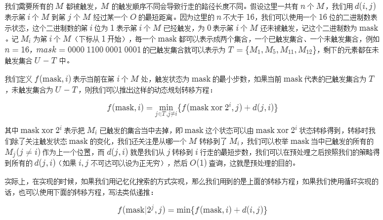
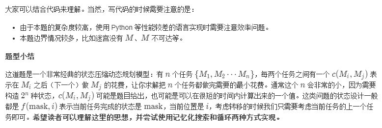

#### [[hard]LCP 13. 寻宝](https://leetcode-cn.com/problems/xun-bao/)

> 我们得到了一副藏宝图，藏宝图显示，在一个迷宫中存在着未被世人发现的宝藏。
>
> 迷宫是一个二维矩阵，用一个字符串数组表示。它标识了唯一的入口（用 'S' 表示），和唯一的宝藏地点（用 'T' 表示）。但是，宝藏被一些隐蔽的机关保护了起来。在地图上有若干个机关点（用 'M' 表示），只有所有机关均被触发，才可以拿到宝藏。
>
> 要保持机关的触发，需要把一个重石放在上面。迷宫中有若干个石堆（用 'O' 表示），每个石堆都有无限个足够触发机关的重石。但是由于石头太重，我们一次只能搬一个石头到指定地点。
>
> 迷宫中同样有一些墙壁（用 '#' 表示），我们不能走入墙壁。剩余的都是可随意通行的点（用 '.' 表示）。石堆、机关、起点和终点（无论是否能拿到宝藏）也是可以通行的。
>
> 我们每步可以选择向上/向下/向左/向右移动一格，并且不能移出迷宫。搬起石头和放下石头不算步数。那么，从起点开始，我们最少需要多少步才能最后拿到宝藏呢？如果无法拿到宝藏，返回 -1 。
>
> gif为示例1：
>
> 
>
> ```shell
> 示例 1：
> 
> 输入： ["S#O", "M..", "M.T"]
> 
> 输出：16
> 
> 解释：最优路线为： S->O, cost = 4, 去搬石头 O->第二行的M, cost = 3, M机关触发 第二行的M->O, cost = 3, 我们需要继续回去 O 搬石头。 O->第三行的M, cost = 4, 此时所有机关均触发 第三行的M->T, cost = 2，去T点拿宝藏。 总步数为16。 
> 
> 示例 2：
> 
> 输入： ["S#O", "M.#", "M.T"]
> 
> 输出：-1
> 
> 解释：我们无法搬到石头触发机关
> 
> 示例 3：
> 
> 输入： ["S#O", "M.T", "M.."]
> 
> 输出：17
> 
> 解释：注意终点也是可以通行的。
> ```
>
> **限制：**
>
> - `1 <= maze.length <= 100`
> - `1 <= maze[i].length <= 100`
> - `maze[i].length == maze[j].length`
> - S 和 T 有且只有一个
> - 0 <= M的数量 <= 16
> - 0 <= O的数量 <= 40，题目保证当迷宫中存在 M 时，一定存在至少一个 O 。
>
> 来源：力扣（LeetCode）
> 链接：https://leetcode-cn.com/problems/xun-bao
> 著作权归领扣网络所有。商业转载请联系官方授权，非商业转载请注明出处。

官方题解：





```cpp
// cpp
// dp状态压缩动态规划模型

class Solution {
public:
    int dx[4] = {-1, 1, 0, 0};
    int dy[4] = {0, 0, -1, 1};
    int n, m;

    bool inBound(int x, int y) {
        return x >= 0 && x < n && y >= 0 && y < m;
    }
    
    vector<vector<int>> bfs(int x, int y, vector<string>& maze) {
        vector<vector<int>> dist(n, vector<int>(m, -1));
        queue<pair<int, int>> Q;
        Q.push({x, y});
        dist[x][y] = 0;

        while (!Q.empty()) {
            auto p = Q.front(); Q.pop();
            int x = p.first, y = p.second;
            for (int i = 0; i < 4; ++i) {
                int nx = x + dx[i], ny = y + dy[i];
                if (inBound(nx, ny) && maze[nx][ny] != '#' && dist[nx][ny] == -1) {
                    dist[nx][ny] = dist[x][y] + 1;
                    Q.push({nx, ny});
                }
            }
        }
        return dist;
    }

    int minimalSteps(vector<string>& maze) {
        n = maze.size();
        m = maze[0].size();

        vector<pair<int, int>> M, O;
        int sx, sy, tx, ty;

        for (int i = 0; i < n; ++i) {
            for (int j = 0; j < m; ++j) {
                char c = maze[i][j];
                if (c == 'S') {
                    sx = i;
                    sy = j;
                } else if (c == 'T') {
                    tx = i;
                    ty = j;
                } else if (c == 'M') {
                    M.push_back({i, j});
                } else if (c == 'O') {
                    O.push_back({i, j});
                }
            }
        } 

        int nm = M.size(), no = O.size();
        vector<vector<int>> start_dist = bfs(sx, sy, maze);
        // 没有机关，则返回起点到终点的最短路径（不能到达为-1）
        if (nm == 0) {
            return start_dist[tx][ty];
        }
		// dist 存储每一个机关到其他机关、起始点和终止点的最短距离
        vector<vector<int>> dist(nm, vector<int>(nm+2, -1));
        // dd 存储每一个机关到地图任意一点的距离
        vector<vector<vector<int>>> dd(nm);
        for (int i = 0; i < nm; ++i) {
            dd[i] = bfs(M[i].first, M[i].second, maze);
            // 每个机关到终点的距离，不需要搬石头
            dist[i][nm+1] = dd[i][tx][ty];
        }
		
        for (int i = 0; i < nm; ++i) {
            // 计算 每个“机关——>搬石头——>机关”的最短距离
            for (int j = i+1; j < nm; ++j) {
                int mn = -1;
                for (int k = 0; k < no; ++k) {
                    int x = O[k].first, y = O[k].second;
                    int di = dd[i][x][y], dj = dd[j][x][y];
                    if (di != -1 && dj != -1) {
                        if (mn == -1 || mn > di + dj) {
                            mn = di + dj;
                        }
                    }
                }
                dist[i][j] = dist[j][i] = mn;
            }
            // 计算 每个”起点——>搬石头——>机关“的最短距离
            int mn = -1;
            for (int j = 0; j < no; ++j) {
                int x = O[j].first, y = O[j].second;
                int di = dd[i][x][y], dj = start_dist[x][y];
                if (di != -1 && dj != -1) {
                    if (mn == -1 || mn > di + dj) {
                        mn = di + dj;
                    }
                }
            }
            dist[i][nm] = mn;
        }

        // 所有某一个机关到不了起点或终点，则说明没有路径，返回-1
        for (int i = 0; i < nm; ++i) {
            if (dist[i][nm] == -1 || dist[i][nm+1] == -1) return -1;
        }
		// 通过“状态压缩动态规划”解决多任务问题
        // dp(mask, i) 为已完成机关mask和当前完成机关i的最短路径
        // mask为二进制，1为已完成的机关，0为未完成的机关
        // dp(mask(j), j) = min(dp(mask(i), i) + dist[i][j]) (i为所有任务且j不在mask(i)中)  
        vector<vector<int>> dp(1 << nm, vector<int>(nm, -1));
        for (int i = 0; i < nm; ++i) {
            dp[1 << i][i] = dist[i][nm];
        }
        for (int mask = 1; mask < (1 << nm); ++mask) {
            for (int i = 0; i < nm; ++i) {
                if (mask & (1 << i)) {
                    for (int j = 0; j < nm; ++j) {
                        if (!(mask & (1 << j))) {
                            int next = mask | (1 << j);
                            if (dp[next][j] == -1 || dp[next][j] > dp[mask][i] + dist[i][j]) {
                                dp[next][j] = dp[mask][i] + dist[i][j];
                            }
                        }
                    }
                }
            }
        }
		// 最后，全1即为完成所有任务，找出其和最后任务与目标距离的和，即为答案
        int ans = -1;
        int finalMask = (1 << nm) - 1;
        for (int i = 0; i < nm; ++i) {
            if (ans == -1 || ans > dp[finalMask][i] + dist[i][nm+1]) {
                ans = dp[finalMask][i] + dist[i][nm+1];
            }
        }
        return ans;
    }
};
```

