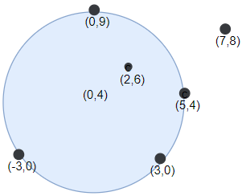

#### [[hard]1453. 圆形靶内的最大飞镖数量](https://leetcode-cn.com/problems/maximum-number-of-darts-inside-of-a-circular-dartboard/)

> 墙壁上挂着一个圆形的飞镖靶。现在请你蒙着眼睛向靶上投掷飞镖。
>
> 投掷到墙上的飞镖用二维平面上的点坐标数组表示。飞镖靶的半径为 `r` 。
>
> 请返回能够落在 **任意** 半径为 `r` 的圆形靶内或靶上的最大飞镖数。
>
> **示例 1：**
>
> 
>
> ```python
> 输入：points = [[-2,0],[2,0],[0,2],[0,-2]], r = 2
> 输出：4
> 解释：如果圆形的飞镖靶的圆心为 (0,0) ，半径为 2 ，所有的飞镖都落在靶上，此时落在靶上的飞镖数最大，值为 4 。
> ```
>
> **示例 2：**
>
> 
>
> ```python
> 输入：points = [[-3,0],[3,0],[2,6],[5,4],[0,9],[7,8]], r = 5
> 输出：5
> 解释：如果圆形的飞镖靶的圆心为 (0,4) ，半径为 5 ，则除了 (7,8) 之外的飞镖都落在靶上，此时落在靶上的飞镖数最大，值为 5 。
> ```
>
> **提示：**
>
> - `1 <= points.length <= 100`
> - `points[i].length == 2`
> - `-10^4 <= points[i][0], points[i][1] <= 10^4`
> - `1 <= r <= 5000`
>
> 来源：力扣（LeetCode）
> 链接：https://leetcode-cn.com/problems/maximum-number-of-darts-inside-of-a-circular-dartboard
> 著作权归领扣网络所有。商业转载请联系官方授权，非商业转载请注明出处。


```cpp
// cpp
// 计算圆心遍历

class Solution {
public:
    int numPoints(vector<vector<int>>& points, int r) {
        int n = points.size();
        int ans = 0;
        double r2 = r * r;
        for (int i = 0; i < n; ++i) {
            double xi = points[i][0], yi = points[i][1];
            for (int j = 0; j < n; ++j) {
                double xj = points[j][0], yj = points[j][1];
                if (i == j || (xi-xj)*(xi-xj) + (yi-yj)*(yi-yj) - 4.0 * r2 > 1e-6) {
                    ans = max(ans, 1);
                    continue;
                }
                double tmp = sqrt(r2 - ((xi-xj)*(xi-xj) + (yi-yj)*(yi-yj)) / 4.0) 
                        / sqrt((yi-yj)*(yi-yj) + (xj-xi)*(xj-xi));
                double xc = (xi + xj) / 2.0 + (yi - yj) * tmp;
                double yc = (yi + yj) / 2.0 + (xj - xi) * tmp;
                int cnt = 0;
                for (int k = 0; k < n; ++k) {
                    double xk = points[k][0], yk = points[k][1];
                    if ((xc-xk)*(xc-xk) + (yc-yk)*(yc-yk) - r2 <= 1e-6) {
                        ++cnt;
                    }
                }
                ans = max(ans, cnt);
            }
        }
        return ans;
    }
};
```


```cpp
// cpp
// Angular Sweep 算法

const double PI = acos(-1);

class Solution {
public:
    int numPoints(vector<vector<int>>& points, int r) {
        if (points.empty()) return 0;
        int n = points.size();
        int ans = 1;
        // 遍历每一个点
        for (int i = 0; i < n; ++i) {
            vector<pair<double, double>> items;
            // 将能被覆盖的点的入角和出角加入 items
            for (int j = 0; j < n; ++j) {
                if (i == j) continue;
                // 计算向量
                double xjxi = points[j][0] - points[i][0];
                double yjyi = points[j][1] - points[i][1];
                double dij = sqrt(xjxi * xjxi + yjyi * yjyi);
                if (dij > 2 * r + 1e-6) continue;
                // 计算角度
                double a = atan(yjyi / xjxi);
                if (xjxi < 0) a = (yjyi > 0) ? a + PI : a - PI; // 扩展到[-pi, pi]区域
                double b = acos(dij / (r * 2));
                items.push_back({a - b, -1});  
                items.push_back({a + b, 1});
            }
            sort(items.begin(), items.end());
            int cnt = 1;
            for (auto &p: items) {
                cnt -= p.second;
                if (cnt > ans) ans = cnt;
            }
        }
        return ans;
    }
};
```

