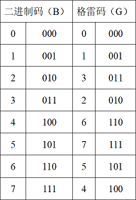

#### [[medium]1238. 循环码排列](https://leetcode-cn.com/problems/circular-permutation-in-binary-representation/)

> 给你两个整数 `n` 和 `start`。你的任务是返回任意 `(0,1,2,,...,2^n-1)` 的排列 `p`，并且满足：
>
> - `p[0] = start`
> - `p[i]` 和 `p[i+1]` 的二进制表示形式只有一位不同
> - `p[0]` 和 `p[2^n -1]` 的二进制表示形式也只有一位不同
>
> ```python
> 示例 1：
> 
> 输入：n = 2, start = 3
> 输出：[3,2,0,1]
> 解释：这个排列的二进制表示是 (11,10,00,01)
>      所有的相邻元素都有一位是不同的，另一个有效的排列是 [3,1,0,2]
> 示例 2：
> 
> 输出：n = 3, start = 2
> 输出：[2,6,7,5,4,0,1,3]
> 解释：这个排列的二进制表示是 (010,110,111,101,100,000,001,011)
> 
> ```
>
> **提示：**
>
> - `1 <= n <= 16`
> - `0 <= start < 2^n`
>
> 来源：力扣（LeetCode）
> 链接：https://leetcode-cn.com/problems/circular-permutation-in-binary-representation
> 著作权归领扣网络所有。商业转载请联系官方授权，非商业转载请注明出处。


> 定义二进制码（B）与对应的格雷码（G），如下表：
>
> 
>
> 二进制码转格雷码：G = B ^ B >> 1；格雷码转二进制码：B = ^(G >> i), i = 0 .. n - 1, n为格雷码二进制位数。
>
> 作者：huanglei15
> 链接：https://leetcode-cn.com/problems/circular-permutation-in-binary-representation/solution/c-yi-ci-xun-huan-zhi-jie-qiu-jie-wei-yun-suan-by-h/
> 来源：力扣（LeetCode）
> 著作权归作者所有。商业转载请联系作者获得授权，非商业转载请注明出处。


```cpp
// cpp
// 格雷码

class Solution {
public:
    vector<int> circularPermutation(int n, int start) {
        vector<int> ans{0};
        for (int i = 0; i < n; ++i) {
            for (int j = ans.size() - 1; j >= 0; --j) {
                ans.push_back((1 << i) + ans[j]);
            }
        }
        
        auto it = find(ans.begin(), ans.end(), start) + 1;
        reverse(ans.begin(), it);
        reverse(it, ans.end());

        return ans;
    }
};
```


```cpp
// cpp
// 格雷码

class Solution {
public:
    vector<int> circularPermutation(int n, int start) {
        int bs = start;
        while (start >>= 1) {
            bs ^= start;
        }

        int m = (1 << n) - 1;
        vector<int> ans(m + 1);
        for (int i = 0; i <= m; ++i) {
            int bin = bs + i & m;
            ans[i] = (bin ^ bin >> 1);
        }

        return ans;
    }
};
```


```python
# python3
# 格雷码

class Solution:
    def circularPermutation(self, n: int, start: int) -> List[int]:
        b = start
        start >>= 1
        while start:
            b ^= start
            start >>= 1
        m = (1 << n) - 1
        return [(b + i & m) ^ (b + i & m) >> 1 for i in range((m + 1))]
```

