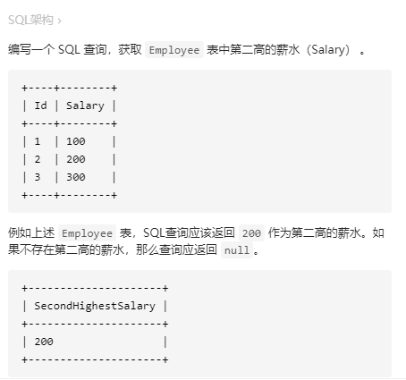

#### [[easy]176. 第二高的薪水](https://leetcode-cn.com/problems/second-highest-salary/)

> 
>
> ```sql
> # sql架构
> Create table If Not Exists Employee (Id int, Salary int)
> Truncate table Employee
> insert into Employee (Id, Salary) values ('1', '100')
> insert into Employee (Id, Salary) values ('2', '200')
> insert into Employee (Id, Salary) values ('3', '300')
> ```


```sql
SELECT (
    SELECT Salary
    FROM Employee
    GROUP BY Salary
    ORDER BY Salary DESC
    LIMIT 1 OFFSET 1
) AS SecondHighestSalary;
```


```sql
SELECT
    IFNULL (
        (SELECT Salary
        FROM Employee
        GROUP BY Salary
        ORDER BY Salary DESC
        LIMIT 1 OFFSET 1),
        NULL
    ) AS SecondHighestSalary;
```

