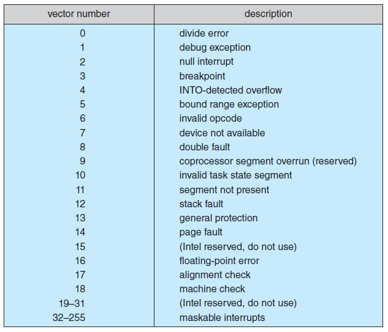

### 概述

##### 定义

- 操作系统包括内核、中间件和系统程序。

- 操作系统的角色：资源管理者和计算机与用户的中间人（提供用户接口）

##### 中断

- CPU接受到中断信号，暂停当前正在进行的程序（保存断点），处理发出信号的事件，然后恢复原来的程序。
- 现代操作系统需要更复杂的中断功能：延迟中断，高效分配中断处理器，设置中断优先级
- 中断分为：不可屏蔽中断（nonmaskable）和可屏蔽中断（maskable），前者为机器或系统错误，后者可为设备消息请求

##### 存储结构

- 层级结构：寄存器->Cache->内存->辅存

##### I/O结构

- DMA(direct memory access)

##### 计算机系统架构

- 单处理器系统
- 多处理器系统和多核系统:
  - SMP( symmetric multiprocessing )
  - NUMA(non-uniform memory access)
  - blade servers
- 集群(clustered)
  - loossely coupled, high-availability service, graceful degradation, fault tolerant
  - asymmetric clustering: hot-standby mode
  - symmetric clustering

##### 多程序和多任务

- 进程：在多程序系统中，程序的一次执行成为进程。
- 内存管理（虚拟内存)、进程管理、文件管理

##### 双模式和多模式操作系统

- 内核态和用户态
- interrupt, trap, system call
- 特权指令

##### 计时器

- 中断计时器，为零时从用户态回到内核态

##### 资源管理

- 进程管理
- 内存管理
- 文件管理
- 辅存管理
- Cache管理
- I/O管理