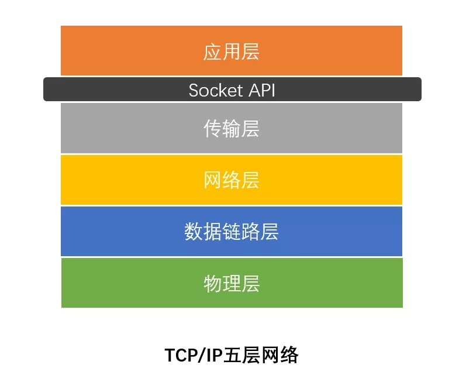
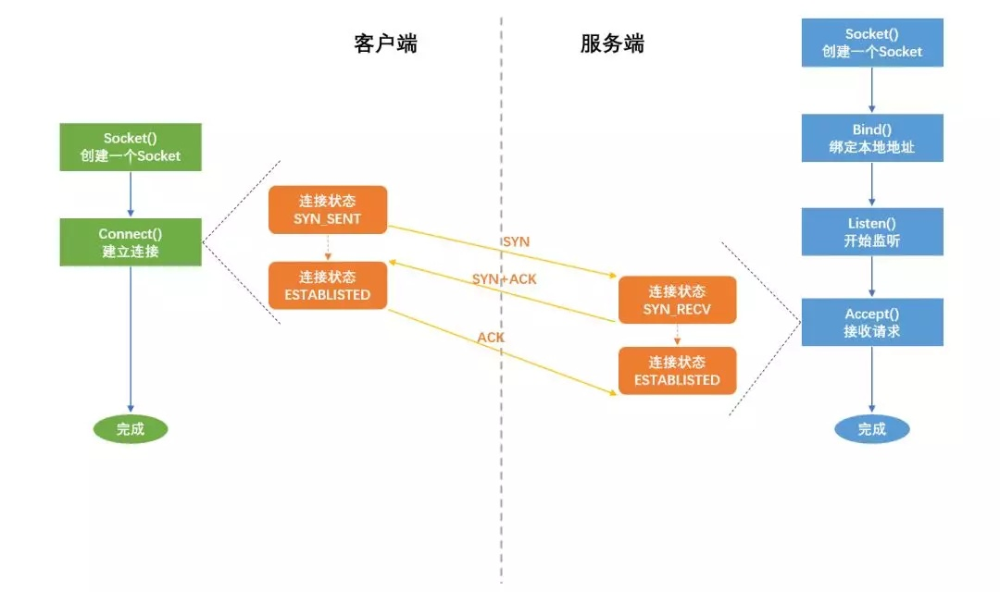
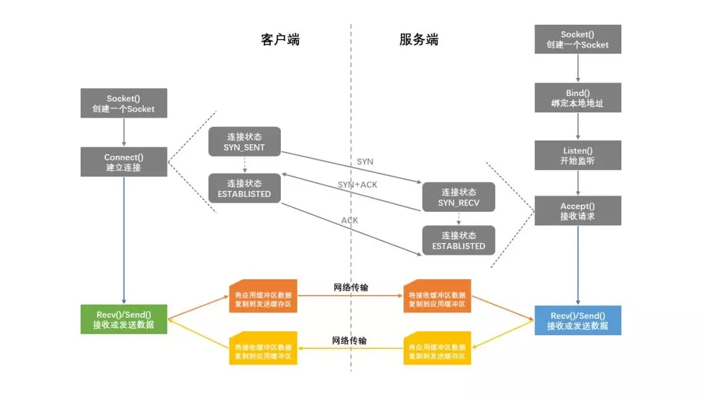
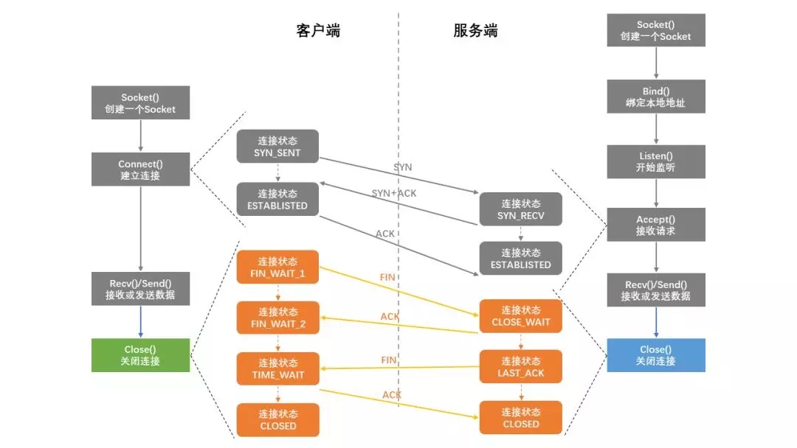
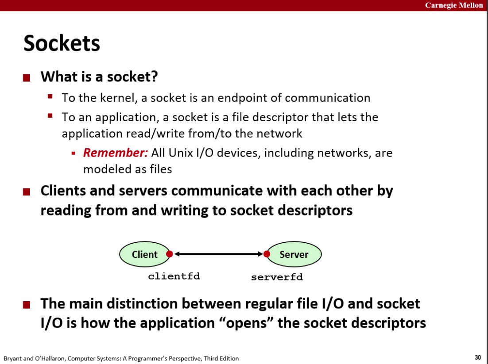

#### [定义](https://www.zhihu.com/question/29637351)

> （1）IP地址：即依照TCP/IP协议分配给本地主机的网络地址，两个进程要通讯，任一进程首先要知道通讯对方的位置，即对方的IP。
>
> （2）端口号：用来辨别本地通讯进程，一个本地的进程在通讯时均会占用一个端口号，不同的进程端口号不同，因此在通讯前必须要分配一个没有被访问的端口号。
>
> （3）连接：指两个进程间的通讯链路。
>
> （4）半相关：网络中用一个三元组可以在全局唯一标志一个进程：
>
> （协议，本地地址，本地端口号）
>
> 这样一个三元组，叫做一个半相关,它指定连接的每半部分。
>
> （4）全相关：一个完整的网间进程通信需要由两个进程组成，并且只能使用同一种高层协议。也就是说，不可能通信的一端用TCP协议，而另一端用UDP协议。因此一个完整的网间通信需要一个五元组来标识：
>
> （协议，本地地址，本地端口号，远地地址，远地端口号）
>
> 这样一个五元组，叫做一个相关（association），即两个协议相同的半相关才能组合成一个合适的相关，或完全指定组成一连接。

#### 层次

> socket 是计算机网络中用于在节点内发送或接收数据的内部端点。具体来说，它是网络软件 (协议栈) 中这个端点的一种表示，包含通信协议、目标地址、状态等，是系统资源的一种形式。
>
> socket 位于`应用层`和`传输层`间

##### 三次握手

##### 通信

##### 四次挥手

#### 概念

